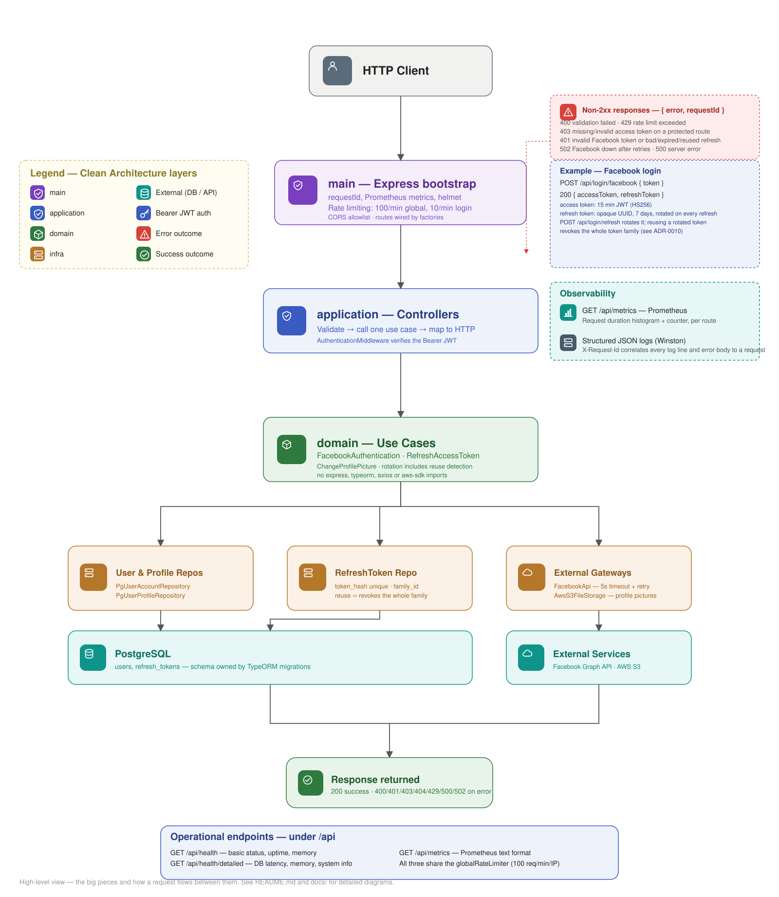
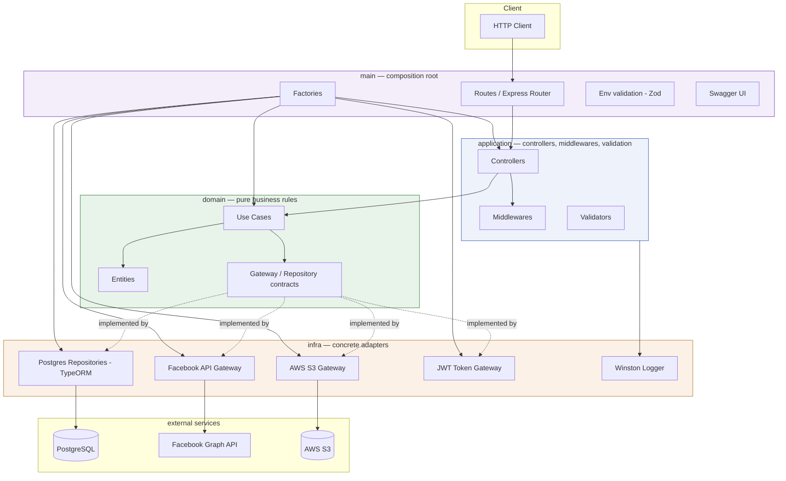

# AuthKit

### Production-Oriented Authentication API — Clean Architecture & TDD

[](https://github.com/luizcurti/authkit-clean-arch/actions/workflows/ci.yml)
[](https://nodejs.org/)
[](https://www.typescriptlang.org/)
[](https://opensource.org/licenses/MIT)

A production-oriented modular monolith demonstrating Clean Architecture, TDD and secure authentication flows: Facebook OAuth login, JWT access tokens with refresh-token rotation and reuse-detection with token-family revocation, S3 profile-picture uploads validated by magic bytes, rate limiting, Prometheus metrics, and E2E tests that run against `pg-mem` instead of a real Postgres instance — built test-first, with 287 unit + 38 E2E tests and fail-fast Zod validation of environment secrets in production.

> Current test suite: **287 unit tests + 38 E2E tests** — all passing, 100% line coverage on collected files. CI runs lint, typecheck, unit, E2E, coverage, security, Docker build and API collection checks on every push.

## 🗺 System Overview



A request enters through `main` (Express bootstrap: middlewares, rate limiting, routing), is validated and dispatched by `application` controllers, executes business logic in framework-free `domain` use cases, and reaches PostgreSQL, the Facebook Graph API or AWS S3 only through `infra` adapters. See the "Architecture Overview" section below for the layering rules, and [docs/](./docs) for per-flow diagrams.

## Why this project?

This project explores how a production-oriented authentication service can be designed around explicit architectural boundaries, automated testing and replaceable infrastructure. The goal isn't to showcase a specific framework — it's to demonstrate engineering decisions around authentication, external integrations, persistence, file storage, security, testing and CI/CD, the kind of problems that show up in real backend systems rather than a CRUD demo.

## Engineering Principles

- Dependency inversion over framework coupling — domain/application depend on contracts, never on Express/TypeORM/Axios directly
- Business rules isolated from infrastructure
- Test behavior rather than implementation details
- Fail fast on invalid configuration (env validation aborts boot in production)
- External dependencies behind ports (storage, token generation, hashing, HTTP)
- Secure defaults (deny-by-default CORS in production, non-root container, hashed refresh tokens)
- Automated quality gates (lint, typecheck, coverage threshold, architecture boundaries, security scans)
- Explicit architectural trade-offs (see [Trade-offs](#trade-offs) below)

## 🔥 Highlights

- Clean Architecture layering (domain / application / infra / main), with the dependency rule enforced by ESLint and an independent architecture test — not just folder convention
- Facebook OAuth login issuing a short-lived JWT access token (15 min) plus a rotating, revocable refresh token (7 days), with reuse-detection that revokes the entire token family (see [ADR-0010](docs/adr/0010-refresh-token-reuse-detection-and-family-revocation.md))
- Prometheus metrics (`GET /api/metrics`) — request-duration histogram and request counter per route (see [ADR-0011](docs/adr/0011-prometheus-metrics-endpoint.md))
- Rate limiting (global + stricter on auth endpoints), Helmet security headers, and a deny-by-default CORS allowlist in production
- Profile picture upload validated by MIME type, size, **and** magic-byte file signature (rejects spoofed `Content-Type`)
- Schema owned by TypeORM migrations (no more hand-maintained SQL dumps), with a separate idempotent seed script
- Request correlation ids (`X-Request-Id`) threaded through logs and error responses
- Central HTTP error mapping (`ExternalServiceError → 502`, validation → 400, auth → 401/403, rate limit → 429)
- Timeout + bounded retry with backoff on the Facebook Graph API client
- Graceful shutdown on `SIGTERM`/`SIGINT`
- Detailed health check (database latency, memory, system info)
- Strong environment validation with Zod (fails fast in production on missing secrets)
- Structured logging (Winston + optional daily rotate)
- E2E route tests with `pg-mem` (no real database required in CI) validated against real PostgreSQL in the `docker` CI job
- Modular factories and adapters for easy extension

## 🧱 Architecture Overview



```
src/
├── domain/        # Business entities + use cases (pure, framework-agnostic)
├── application/   # Controllers, DTOs, validation, orchestration
├── infra/         # External implementations (DB, gateways, APIs, logger)
└── main/          # Composition root: config, env, routes, factories, app bootstrap
```

### Layering Principles
- Domain: pure logic (entities, use cases) without external dependencies.
- Application: coordinates domain use cases + input/output mapping.
- Infra: concrete adapters (PostgreSQL via TypeORM, Facebook API, AWS S3, logging).
- Main: wiring, DI-style factories, server bootstrap, Express configuration.

### Architecture Decisions

The dependency rule isn't just a folder convention — it's enforced by tooling in two independent ways:

- **`domain` and `application` must never import**: `express`, `typeorm`, `axios`, `multer`, `winston`, `jsonwebtoken`, `@aws-sdk/*`, or anything under `infra`/`main`. This is enforced by an ESLint `no-restricted-imports` rule (`eslint.config.js`) that fails the `lint` CI job.
- A second, independent check — `tests/architecture/import-boundaries.spec.ts` — statically scans every file under `src/domain` and `src/application` for the same banned imports and fails the `test` CI job if it finds one. It doesn't depend on lint config staying correct, so it survives someone disabling the ESLint rule inline.
- `application` may depend on domain contracts. `infra` implements domain/application contracts. `main` is the only place responsible for composition (factories wire concrete infra adapters into use cases and controllers).
- Concrete example: `AdvancedHealthCheckController` depends only on a local `DatabaseChecker` port and an `application/contracts/Logger` port — never on `PgConnection` or the Winston logger directly. Both ports are satisfied by infra adapters wired in `main`.

Full rationale for every non-obvious decision — not just the ones below — lives in [`docs/adr/`](docs/adr/README.md) as versioned Architecture Decision Records.

### Trade-offs

- **Why Express, not NestJS?** — the point of this project is to demonstrate architecture independently from framework conventions, so Express is intentionally used as a thin HTTP adapter rather than the source of structure. ([ADR-0002](docs/adr/0002-express-as-thin-http-adapter.md))
- **Why TypeORM?** — the user/refresh-token model benefits from relational constraints (unique token hash, FK, transactional consistency); replacing TypeORM should only touch `infra/repos/postgres/**`, since domain/application never import it. ([ADR-0003](docs/adr/0003-typeorm-for-persistence.md))
- **Why pg-mem for E2E instead of real Postgres?** — pg-mem gives fast, deterministic tests with zero external services in CI; it can diverge from real Postgres behavior, so the `docker` CI job separately boots the real `docker compose` stack (real Postgres, real migrations) and runs the same API contract checks against it. ([ADR-0004](docs/adr/0004-pg-mem-for-e2e-tests.md))
- **Why JWT + a separate opaque refresh token, not sessions?** — stateless verification for the short-lived access token, while the refresh token is stored server-side (hashed) so it can be revoked and rotated — a plain JWT can't be revoked before it expires. ([ADR-0005](docs/adr/0005-jwt-access-token-with-opaque-refresh-token.md))
- **Why hash the refresh token with SHA-256 instead of bcrypt?** — the refresh token is already a high-entropy random value (not a low-entropy secret like a password), so a fast cryptographic hash is appropriate; bcrypt's deliberate slowness defends against guessing low-entropy secrets, which isn't the threat model here. ([ADR-0006](docs/adr/0006-sha256-hash-for-refresh-tokens.md))
- **Why is Helmet's CSP disabled?** — the API also serves Swagger UI (`/api-docs`), which relies on inline scripts a default CSP would block. HSTS, frame protection and MIME-sniff protection stay on; CSP is a documented gap, not an oversight. ([ADR-0007](docs/adr/0007-csp-disabled-for-swagger-ui.md))
- **Why in-memory rate limiting instead of Redis?** — the app runs as a single instance, so per-process limits are correct and match the deployment as it stands. ([ADR-0008](docs/adr/0008-in-memory-rate-limiting.md))
- **Why a modular monolith, not microservices?** — the application is intentionally designed as a modular monolith. Business rules are separated from infrastructure by the Clean Architecture layering, not by service boundaries, so the system stays a single deployable without a corresponding operational problem that microservices would solve. ([ADR-0009](docs/adr/0009-modular-monolith.md))
- **Why does reusing a rotated refresh token revoke the whole token family, not just that one token?** — a stolen token that was already rotated once (by attacker or legitimate client) means both resulting sessions descend from the same compromised original; revoking only the reused token leaves the other, currently-active session alive. ([ADR-0010](docs/adr/0010-refresh-token-reuse-detection-and-family-revocation.md))
- **Why Prometheus metrics instead of full OpenTelemetry tracing?** — metrics need no external backend to be useful (`curl /api/metrics` is enough); distributed tracing needs a trace backend (Jaeger/Tempo) that this project does not run. ([ADR-0011](docs/adr/0011-prometheus-metrics-endpoint.md))

## 🧰 Tech Stack

- Node.js >= 24
- TypeScript 5.9
- Express 4
- PostgreSQL 15 (TypeORM, migration-managed schema)
- Jest + ts-jest (unit/integration tests)
- Zod (environment & input validation)
- Multer (multipart handling)
- AWS SDK v3 (S3 uploads - optional)
- Axios (HTTP calls, with timeout + retry)
- express-rate-limit + Helmet (rate limiting & security headers)
- prom-client (Prometheus metrics)
- Winston (logging)
- Swagger UI Express (API docs)

## 📁 Key Directories

| Path | Purpose |
|------|---------|
| `src/domain` | Business rules, entities, use cases |
| `src/application` | Controllers, middlewares, DTOs, validation builders |
| `src/infra` | Gateways, repositories (incl. migrations), external services implementations |
| `src/main` | App entrypoint (`index.ts`), env config, factories, routes, Swagger |
| `tests` | Unit, E2E, architecture and external integration tests (mirrors `src` structure) |
| `scripts` | Maintenance scripts, DB seed, and the API collection test runner |
| `docs` | Architecture/flow diagrams (Mermaid), ADRs (`docs/adr`) and the Postman collection |

## 🚀 Getting Started

```bash
# Clone the repository
git clone <repository-url>
cd authkit-clean-arch

# Install dependencies
npm install

# Copy environment template and adjust values
cp .env.example .env

# Start PostgreSQL (+ optional PgAdmin) via Docker
docker compose up -d postgres pgadmin

# Apply database migrations, then seed a fixture user
npm run migration:run
npm run db:seed

# Type check
npm run typecheck

# Development: tsc watch + nodemon serving the compiled output
npm run start:dev

# Or: run TypeScript directly via tsx watch, no separate build step
npm run dev
```

Access health check: `http://localhost:8080/api/health`  
Swagger docs: `http://localhost:8080/api-docs`

Prefer to run the whole stack (API + database) in containers? See [Docker Setup](#docker-setup).

## 🧪 Testing

```bash
# Run all unit tests (includes repository tests against pg-mem, an in-memory Postgres)
npm test

# Run E2E route tests (uses pg-mem — no real DB needed)
npm run test:e2e

# Coverage report
npm run test:coverage

# Watch mode
npm run test:watch

# API collection checks against a running instance (see API Collection Tests below)
npm run test:api
```

Coverage reports stored in `coverage/` (HTML + lcov). Current line coverage is 100% on collected files (`jest.config.js` excludes the composition root — `src/main/**` — and generated migrations, both exercised via E2E/manual migration runs instead of unit tests).

`tests/architecture/import-boundaries.spec.ts` runs alongside the rest of the unit suite and fails the build if `domain`/`application` import a framework, infra or main module — see [Architecture Decisions](#architecture-decisions).

### Live external integration tests (opt-in)

`tests/external/*.test.ts` call the real Facebook Graph API and real AWS S3 — they need valid, non-expired credentials and are **not** part of the default CI pipeline (there's nothing to assert deterministically without live secrets). These scripts load `.env` (`-r dotenv/config`), unlike the unit/E2E scripts:

```bash
npm run test:integration   # both external suites
npm run test:fb-api        # Facebook Graph API only
npm run test:s3            # AWS S3 only
```

- **S3 test**: needs real `S3_ACCESS_KEY_ID`/`S3_SECRET_ACCESS_KEY`/`S3_BUCKET`, and `S3_REGION` matching the bucket's actual region (a mismatch fails with `PermanentRedirect`, not a credentials error).
- **Facebook test**: set `FB_TEST_USER_TOKEN` in `.env` to a fresh Facebook test-user token (Graph API Explorer, or a test user under your app) — it's short-lived and intentionally **not** committed to source, so the test skips itself when the variable is unset instead of failing on a stale token.

### CI Pipeline

GitHub Actions runs on every push:

| Job | What it does |
|-----|-------------|
| `lint` | ESLint check, including the domain/application import-boundary rule |
| `typecheck` | `tsc --noEmit` |
| `security` | `npm audit` (blocking) + Snyk scan (advisory) |
| `test` | Unit tests (Jest), including repository tests against pg-mem and the architecture boundary test |
| `coverage` | Coverage run + Codecov upload + 90% line-coverage gate |
| `test-e2e` | E2E route tests with pg-mem |
| `docker` | Builds the app image, boots the real `docker compose` stack (real Postgres, migrations + seed run automatically), and runs the API collection checks (`npm run test:api`) against it |
| `build` | Compiles TypeScript, runs only after `lint`, `typecheck`, `test` and `test-e2e` pass |

## 🏗 Build & Run (Production)

```bash
# Compile TypeScript
npm run build

# Apply migrations against the compiled output, then seed
npm run migration:run:prod
npm run db:seed

# Start production server
npm start
```

Environment variables are validated at startup (see `src/main/config/env.ts`). Missing required secrets in production will abort boot.

## 🔐 Authentication Flow

1. Client obtains a Facebook OAuth token externally.
2. Calls `POST /api/login/facebook` with `{ token }` (rate limited to 10 req/min/IP).
3. API validates the token with the Facebook Graph API (timeout + bounded retry; a persistently unavailable Facebook returns `502`, an invalid token returns `401`), creates/updates the local account.
4. Issues a JWT `accessToken` (15 min) and a `refreshToken` (7 days, opaque, stored server-side only as a SHA-256 hash).
5. When the access token expires, the client calls `POST /api/login/refresh` with `{ refreshToken }`. The API validates the hash, **revokes** the old refresh token, and issues a brand-new access/refresh pair (rotation) — reusing an already-rotated or revoked refresh token returns `401` **and revokes every other token descended from the same original login** (token-family revocation), so a stolen-then-rotated token can't leave a live session behind. See [ADR-0010](docs/adr/0010-refresh-token-reuse-detection-and-family-revocation.md).
6. Subsequent protected endpoints accept either `Authorization: Bearer <accessToken>` (standard scheme, also what Swagger UI sends) or the raw `Authorization: <accessToken>`.

## 🛡 Security

- **Rate limiting**: 100 req/min/IP globally, 10 req/min/IP on `POST /login/facebook` and `POST /login/refresh` (`express-rate-limit`, disabled automatically under `NODE_ENV=test`).
- **Helmet**: security headers on every response (CSP is deliberately off — see [Trade-offs](#trade-offs)).
- **CORS**: allowlist-driven via `CORS_ALLOWED_ORIGINS`; an empty allowlist in production denies all cross-origin requests by default instead of falling back to `*`.
- **Refresh token rotation + revocation + reuse detection**: only the SHA-256 hash is persisted; each refresh revokes the previous token, so a stolen-but-unused refresh token is invalidated the moment the legitimate client refreshes. Presenting an already-rotated token (reuse) revokes its **entire token family**, not just that one token — see [ADR-0010](docs/adr/0010-refresh-token-reuse-detection-and-family-revocation.md).
- **Upload magic-byte validation**: the declared `Content-Type` of an uploaded file is cross-checked against its actual byte signature (PNG/JPEG), rejecting files that lie about their type.
- **Dependency hygiene**: Dependabot (`.github/dependabot.yml`) checks npm, GitHub Actions and Docker base images weekly; `npm audit` + Snyk run on every CI push.

## 📦 Profile Picture Handling

Endpoint: `PUT /api/users/picture`
- Accepts multipart field `picture` (PNG/JPG)
- Validations, in order: required, allowed MIME type, max size (5MB), magic-byte signature match — fallback to initials when there's no picture.
- Optional AWS S3 storage (configure S3 env vars). If not set, can store locally or skip upload depending on infra adapter.

Remove picture: `DELETE /api/users/picture` → returns initials and clears stored reference.

## 🩺 Health Checks

- `GET /api/health`: basic status, uptime, memory summary.
- `GET /api/health/detailed`: adds DB latency, memory breakdown, system info (platform, Node version, PID).

## 📘 API Documentation

Swagger UI available after server start: `http://localhost:8080/api-docs`  
Raw spec: `./src/main/docs/swagger.json`

### Core Endpoints
| Method | Path | Description |
|--------|------|-------------|
| POST | `/api/login/facebook` | Login via Facebook OAuth token — returns access + refresh token |
| POST | `/api/login/refresh` | Exchange a refresh token for a new access/refresh pair (rotation) |
| PUT | `/api/users/picture` | Upload / replace profile picture |
| DELETE | `/api/users/picture` | Remove profile picture |
| GET | `/api/health` | Basic health check |
| GET | `/api/health/detailed` | Detailed health diagnostics |
| GET | `/api/metrics` | Prometheus metrics (request duration/count per route) |

### cURL Examples
```bash
# Facebook Login
curl -X POST http://localhost:8080/api/login/facebook \
  -H "Content-Type: application/json" \
  -d '{"token": "FACEBOOK_OAUTH_TOKEN"}'

# Refresh Token
curl -X POST http://localhost:8080/api/login/refresh \
  -H "Content-Type: application/json" \
  -d '{"refreshToken": "<REFRESH_TOKEN>"}'

# Upload Picture
curl -X PUT http://localhost:8080/api/users/picture \
  -H "Authorization: Bearer <JWT>" \
  -F "picture=@avatar.jpg"

# Basic Health
curl http://localhost:8080/api/health

# Prometheus Metrics
curl http://localhost:8080/api/metrics
```

## 📚 Diagrams

Architecture, request-flow (login, refresh-token rotation/reuse-detection, picture upload), deployment and database-schema diagrams live in [`docs/`](./docs) (Mermaid sources in `docs/mmd`, rendered PNGs in `docs/img`). The rationale behind each non-obvious engineering decision is recorded as an ADR in [`docs/adr/`](docs/adr/README.md).

## 📮 API Collection Tests

A Postman collection covering success, validation-error, auth-failure and not-found scenarios lives in [`docs/api`](./docs/api) — import `collection.postman_collection.json` and `environment.postman_environment.json` into Postman/Insomnia. Generate a test JWT for the `accessToken` variable with:

```bash
node scripts/generate-test-token.js         # signs { key: '1' }, matching the user seeded by `npm run db:seed`
```

The same checks run without Postman/newman via a small dependency-free script (used in CI's `docker` job):

```bash
npm run test:api   # hits API_BASE_URL (default http://localhost:8080/api)
```

## 🐳 Docker Setup

`docker-compose.yml` defines:
- `app`: the API itself, built from the root `Dockerfile` (multi-stage: compile TypeScript, then a slim, non-root production runtime image). On boot it runs pending migrations, seeds the fixture user, then starts the server.
- `postgres`: PostgreSQL 15-alpine, starting from an empty schema — `app` owns migrations.
- `pgadmin`: DB admin UI (optional)

```bash
# Build and start the full stack (API + database)
docker compose up -d --build postgres app

# Database admin UI (optional)
docker compose up -d pgadmin

# View logs
docker compose logs -f app

# Stop
docker compose down
```

The `app` container reads its configuration from environment variables (see `docker-compose.yml`); when a root `.env` file exists, Docker Compose uses it to fill in those values, otherwise safe development defaults are used — the same defaults `src/main/config/env.ts` falls back to outside of production.

## 🗄 Database Migrations

Schema is owned by TypeORM migrations (`src/infra/repos/postgres/migrations/`), generated from the entities in `src/infra/repos/postgres/entities/`.

```bash
# Generate a new migration from entity changes (needs a running Postgres)
npm run migration:generate -- src/infra/repos/postgres/migrations/DescriptiveName

# Apply pending migrations (TS source, local dev)
npm run migration:run

# Apply pending migrations (compiled output, e.g. in a deployed image)
npm run migration:run:prod

# Revert the last migration
npm run migration:revert

# Seed the fixture user used by the Postman collection / API collection tests
npm run db:seed
```

## 🔧 Environment Variables

See `.env.example` for the annotated list. `.env` itself is gitignored — never commit real secrets. Production requires:
- `FB_CLIENT_ID`, `FB_CLIENT_SECRET`
- `JWT_SECRET` (>=32 chars)
- `S3_ACCESS_KEY_ID`, `S3_SECRET_ACCESS_KEY`, `S3_BUCKET` (if S3 enabled)
- `DB_HOST`, `DB_PORT`, `DB_USER`, `DB_PASSWORD`, `DB_DATABASE`

Optional:
- `CORS_ALLOWED_ORIGINS` — comma-separated allowlist; empty in production denies all cross-origin requests (safe default), empty in development/test allows all.
- `S3_REGION` — region your bucket lives in (default: `us-east-1`); a mismatch here causes AWS to reject uploads with a `PermanentRedirect` error.

Default development fallbacks exist but aren't safe for production.

## 🛠 Quality & Maintenance

```bash
# Lint (includes the domain/application architecture boundary rule)
npm run lint

# Lint with autofix
npm run lint:fix

# List outdated dependencies
npm run check

# Upgrade package.json to latest versions (review before installing)
npm run update

# Type-only check
npm run typecheck
```

`scripts/migrate.sh` does a clean `node_modules`/lockfile reinstall plus a typecheck + build, useful after a dependency bump. A `husky` pre-commit hook runs `lint-staged` (ESLint --fix + related Jest tests) on staged `.ts` files. Dependabot opens weekly PRs for npm, GitHub Actions and Docker base image updates.

## 🪵 Logging & Metrics

- Winston with optional daily rotate file transport (enable via env flags).
- Every request gets a correlation id (`X-Request-Id`, generated or echoed from the incoming header), included in access logs and in non-2xx JSON error bodies.
- Structured JSON logs for errors with stack trace.
- Startup shows port, environment, health endpoint.
- Prometheus metrics at `GET /api/metrics`: `http_request_duration_seconds` (histogram, labeled by method/route/status) and `http_requests_total` (counter), plus default Node process metrics — see [ADR-0011](docs/adr/0011-prometheus-metrics-endpoint.md).

## ⚙️ Current Scale & Constraints

- Single application instance — rate limiting state is per-process, using `express-rate-limit`'s in-memory store ([ADR-0008](docs/adr/0008-in-memory-rate-limiting.md))
- Observability is Prometheus metrics (aggregate request volume, latency and error rate) plus structured logs with correlation IDs; there is no distributed tracing across HTTP → DB → Facebook → S3 spans ([ADR-0011](docs/adr/0011-prometheus-metrics-endpoint.md))
- Profile-picture uploads are proxied through the API; the client does not upload directly to S3
- A single PostgreSQL instance serves all reads and writes
- The system is a modular monolith — one deployable, one database — with business rules separated from infrastructure by the Clean Architecture layering rather than by service boundaries ([ADR-0009](docs/adr/0009-modular-monolith.md))

## 🤝 Contributing
1. Fork & clone
2. Create feature branch (`git checkout -b feat/my-change`)
3. Ensure tests & coverage remain high
4. Submit PR with clear description & rationale

## 🛡 License
[MIT](./LICENSE)

## 💬 Support
For questions open an Issue or consult Swagger spec.

---
Made with a TDD-first mindset for reliability and evolution.
