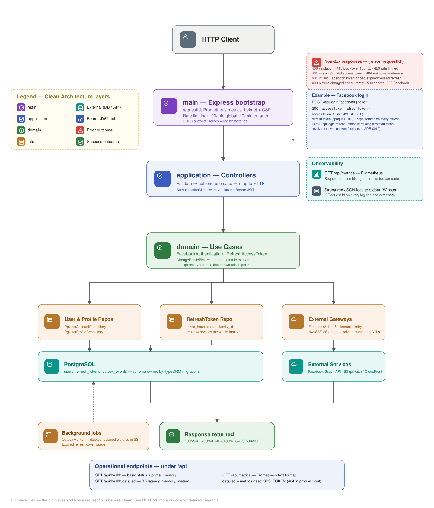

# AuthKit

[](https://github.com/luizcurti/authkit-clean-arch/actions/workflows/ci.yml)
[](https://nodejs.org/)
[](https://www.typescriptlang.org/)
[](https://opensource.org/licenses/MIT)

An authentication API in TypeScript, built test-first with Clean Architecture. Clients log in with a Facebook token and receive a short-lived JWT access token plus a rotating refresh token. Authenticated users manage a profile picture stored in a private S3 bucket.

## Features

- **Refresh-token rotation with reuse detection.** Tokens are opaque, stored hashed and rotated atomically. Replaying a rotated token revokes its whole session, except within a 5-second grace window for concurrent refreshes.
- **Facebook login hardening.** The token's `app_id` must match the configured app, and accounts are identified by Facebook id, never re-bound through a matching email.
- **JWT hygiene.** HS256 is pinned, tokens carry `sub`/`iss`/`aud`, only the `Bearer` scheme is accepted, and a missing or invalid token gets `401` with a `WWW-Authenticate` challenge. Logout revokes the session.
- **Private picture storage.** Uploads are checked by size, type and the magic bytes of the declared type, stored without ACLs and served through a CDN or pre-signed URLs. Replaced pictures are deleted by a transactional outbox worker only after the change commits.
- **Secure defaults.** Invalid configuration stops the app. CSP is on, rate limiting is active, and every error is JSON with a request id. In production, Swagger is off and metrics sit behind a token.

## Architecture



- **Layers:** `main` (Express, composition, background jobs) → `application` (controllers, validation) → `domain` (use cases and rules, no framework imports) → `infra` (PostgreSQL, Facebook and S3 adapters). ESLint enforces the dependency rule.
- **Deployment:** one stateless container with a PostgreSQL database and an S3 bucket (optionally behind CloudFront). The only AWS service used is S3; there is no Lambda, API Gateway or infrastructure-as-code in this repository.
- **Background jobs:** the outbox worker and the expired refresh-token purge run on in-process timers, or as one-off scripts from an external scheduler.

Details: [architecture guide](docs/architecture.md), [diagrams](docs/README.md), [decision records](docs/adr/README.md).

## Requirements

- Node.js 24 (LTS) and npm 10+
- Docker with Compose v2

No Facebook or AWS account is needed locally: S3 is emulated by S3Mock and the tests stub Facebook.

## Quick start with Docker

```bash
docker compose up -d --build                 # PostgreSQL, S3Mock, migrations, API on :8080
docker compose exec app npm run db:seed      # fixture user id=1 ("Loro")

TOKEN=$(docker compose exec -T app node scripts/generate-test-token.js 1)
curl -X PUT http://localhost:8080/api/users/picture -H "Authorization: Bearer $TOKEN" -F "picture=@docs/api/fixtures/avatar.png"
# {"pictureUrl":"http://localhost:9090/authkit-pictures/1_<uuid>.png"}
```

Health: <http://localhost:8080/api/health>. Swagger UI: <http://localhost:8080/api-docs>. Stop with `docker compose down` (add `-v` to drop the database).

## Local development

```bash
npm install && cp .env.example .env
docker compose up -d postgres s3mock
npm run migration:run && npm run db:seed
npm run dev                                  # ts-node with --watch on :8080, debugger on :9229
```

## Environment variables

Every variable is validated at startup ([`src/main/config/env.ts`](src/main/config/env.ts)); an invalid value stops the app. Outside production everything has a development default, so `.env` is optional. In production these are required:

| Variable | Purpose |
|----------|---------|
| `FB_CLIENT_ID`, `FB_CLIENT_SECRET` | Facebook app credentials |
| `JWT_SECRET` | HS256 signing key, at least 32 characters |
| `S3_ACCESS_KEY_ID`, `S3_SECRET_ACCESS_KEY`, `S3_BUCKET` | Picture storage |
| `DB_HOST`, `DB_PORT`, `DB_USER`, `DB_PASSWORD`, `DB_DATABASE` | PostgreSQL (defaults target the local container) |

The optional ones (CORS, `OPS_TOKEN`, rate limits, job intervals, CDN URL, log level) are listed in [operations](docs/operations.md#configuration) and [`.env.example`](.env.example).

## Lint, typecheck, build

```bash
npm run lint          # ESLint: code rules, formatting and the layer-boundary rule
npm run typecheck     # tsc --noEmit over src and tests (strict)
npm run build         # compile to dist/
```

## Tests

| Command | What it runs | Needs |
|---------|--------------|-------|
| `npm test` | Unit tests and E2E route tests through the real Express app on pg-mem | nothing |
| `npm run test:coverage` | The same, with a 100% coverage gate | nothing |
| `npm run test:e2e` | Only the E2E route tests | nothing |
| `npm run test:pg` | Integration tests on real PostgreSQL: concurrency, constraints, outbox claiming, migrations up/down | `docker compose up -d postgres` |
| `npm run test:s3` | The S3 adapter against S3Mock (or real AWS) | `docker compose up -d s3mock` and the S3 values from `.env.example` |
| `npm run test:api` | The Postman collection with newman against the running container | the stack below |
| `npm run test:fb-api` | The live Facebook Graph API | a Facebook app and `FB_TEST_USER_TOKEN` |

The Postman run sends more auth requests than the default rate limit allows, so start the stack with raised limits:

```bash
RATE_LIMIT_PER_MINUTE=1000 AUTH_RATE_LIMIT_PER_MINUTE=1000 docker compose up -d --build
docker compose exec app npm run db:seed
npm run test:api
```

More in the [development guide](docs/development.md).

## API

| Method | Path | Auth | Description |
|--------|------|------|-------------|
| POST | `/api/login/facebook` | — | Exchange a Facebook token for an access token (15 min) and a refresh token (7 days) |
| POST | `/api/login/refresh` | — | Rotate a refresh token into a new pair |
| POST | `/api/logout` | — | Revoke the session; always `204` |
| PUT | `/api/users/picture` | Bearer | Upload or replace the picture (multipart field `picture`, PNG/JPG, 5 MB) |
| DELETE | `/api/users/picture` | Bearer | Remove the picture; returns initials |
| GET | `/api/health` | — | Liveness |
| GET | `/api/health/detailed`, `/api/metrics` | `OPS_TOKEN` | Database and runtime checks, Prometheus metrics |

Errors are always `{ "error": "...", "requestId": "..." }`. Status codes, examples and the OpenAPI spec: [API reference](docs/api.md).

## CI

GitHub Actions ([`ci.yml`](.github/workflows/ci.yml)) runs on pushes and pull requests to `main` and `develop`. Any failing step fails the build:

- **quality:** lint and format check, typecheck, `npm audit`, build (Snyk advisory, when its token is set).
- **verify:** unit and E2E tests with the coverage gate, PostgreSQL and S3Mock integration tests, migration drift check, Docker image build, the Compose stack with the Postman collection run against it, and a check that the image refuses to start in production without secrets.

## Architectural decisions

Recorded as ADRs in [`docs/adr`](docs/adr/README.md). The main ones: Clean Architecture layering (0001), opaque hashed refresh tokens with family revocation (0005, 0006, 0010, 0013), in-memory rate limiting for a single instance (0008), account identity by Facebook id (0014), private storage with S3Mock locally (0015), and the transactional outbox for picture cleanup (0016).

## License

[MIT](./LICENSE)
