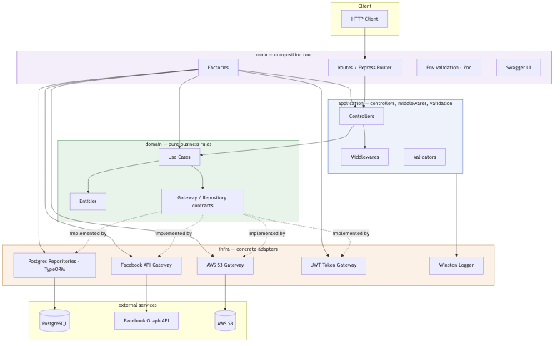
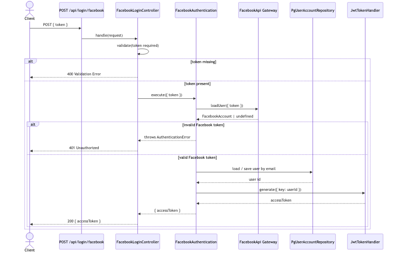
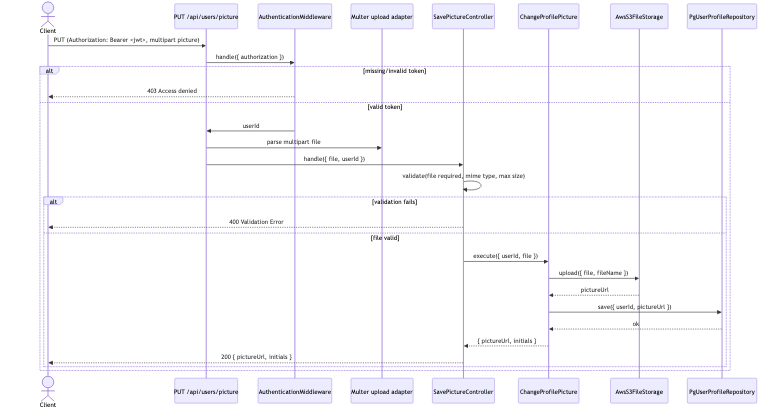
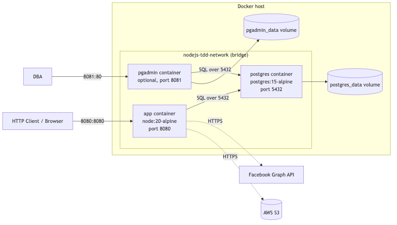
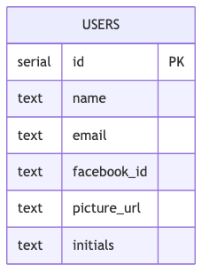

# Documentation

Architecture and flow diagrams for the Advanced TDD Clean Architecture API. Sources live in [`mmd/`](./mmd) (Mermaid), rendered PNGs in [`img/`](./img). The Postman collection lives in [`api/`](./api).

## System architecture

Layering (domain / application / infra / main) and how each layer's contracts are implemented by concrete infra adapters.



Source: [`mmd/architecture-overview.mmd`](./mmd/architecture-overview.mmd)

## Facebook login flow

`POST /api/login/facebook` — from the HTTP request down to the Facebook Graph API call, user upsert, and JWT issuance.



Source: [`mmd/request-flow-facebook-login.mmd`](./mmd/request-flow-facebook-login.mmd)

## Profile picture upload flow

`PUT /api/users/picture` — authentication, multipart parsing, validation (mime type / size), S3 upload, and repository update.



Source: [`mmd/request-flow-picture-upload.mmd`](./mmd/request-flow-picture-upload.mmd)

## Deployment (Docker)

Containers, network, and volumes defined in `docker-compose.yml`, plus the external services the `app` container talks to.



Source: [`mmd/deployment-docker.mmd`](./mmd/deployment-docker.mmd)

## Database schema

The API currently persists a single `users` table (see `dump.sql` and `src/infra/repos/postgres/entities/user.ts`).



Source: [`mmd/db-schema.mmd`](./mmd/db-schema.mmd)

## Regenerating the images

```bash
npx --yes -p @mermaid-js/mermaid-cli mmdc -i docs/mmd/<name>.mmd -o docs/img/<name>.png -b transparent
```

## API collection

[`api/collection.postman_collection.json`](./api/collection.postman_collection.json) and [`api/environment.postman_environment.json`](./api/environment.postman_environment.json) are importable into Postman/Insomnia. See the root [README](../README.md#api-collection-tests) for how to generate a test JWT and run the equivalent checks from the CLI.
