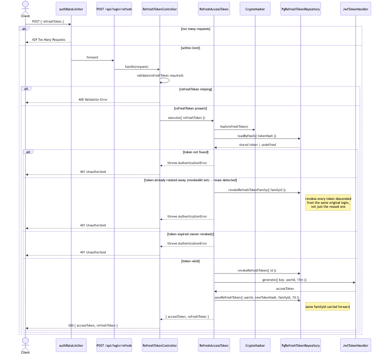

# Documentation

Architecture and flow diagrams for AuthKit. Sources live in [`mmd/`](./mmd) (Mermaid), rendered PNGs in [`img/`](./img). The Postman collection lives in [`api/`](./api). The rationale behind each non-obvious engineering decision is recorded as an ADR in [`adr/`](./adr/README.md).

## System overview (top-level, in the root README)

[`docs/src/system-overview.svg`](./docs/src/system-overview.svg) is the single-image, high-level view embedded at the top of the root [README](../README.md) — the request path through `main` → `application` → `domain` → `infra`, the data stores and external services, response codes, and the observability/health endpoints. Source and rendering both live in `system-overview.html` next to it; edit the SVG markup there and re-extract it (the `<svg>` element, inlined styles included) into `system-overview.svg`.

## System architecture

Layering (domain / application / infra / main) and how each layer's contracts are implemented by concrete infra adapters.


Source: [`mmd/architecture-overview.mmd`](./mmd/architecture-overview.mmd)

## Facebook login flow

`POST /api/login/facebook` — rate limiting, the Facebook Graph API call (with retry/timeout), user upsert, and access/refresh token issuance.


Source: [`mmd/request-flow-facebook-login.mmd`](./mmd/request-flow-facebook-login.mmd)

## Refresh-token rotation & reuse detection

`POST /api/login/refresh` — hash lookup, rotation of a valid token, and what happens when an already-rotated token is presented again: the entire token family is revoked, not just the reused token (see [ADR-0010](./adr/0010-refresh-token-reuse-detection-and-family-revocation.md)).



Source: [`mmd/request-flow-refresh-token.mmd`](./mmd/request-flow-refresh-token.mmd)

## Profile picture upload flow

`PUT /api/users/picture` — authentication, multipart parsing, validation (mime type / size / magic-byte signature), S3 upload, and repository update.


Source: [`mmd/request-flow-picture-upload.mmd`](./mmd/request-flow-picture-upload.mmd)

## Deployment (Docker)

Containers, network, and volumes defined in `docker-compose.yml`, plus the external services the `app` container talks to.


Source: [`mmd/deployment-docker.mmd`](./mmd/deployment-docker.mmd)

## Database schema

Schema is owned by TypeORM migrations (see `src/infra/repos/postgres/migrations/` and the entities in `src/infra/repos/postgres/entities/`) — `users` plus `refresh_tokens` (with `family_id` for reuse-detection/family revocation) for refresh-token rotation/revocation.


Source: [`mmd/db-schema.mmd`](./mmd/db-schema.mmd)

## Regenerating the images

```bash
npx --yes -p @mermaid-js/mermaid-cli mmdc -i docs/mmd/<name>.mmd -o docs/img/<name>.png -b transparent
```

## API collection

[`api/collection.postman_collection.json`](./api/collection.postman_collection.json) and [`api/environment.postman_environment.json`](./api/environment.postman_environment.json) are importable into Postman/Insomnia. See the root [README](../README.md#api-collection-tests) for how to generate a test JWT and run the equivalent checks from the CLI.
