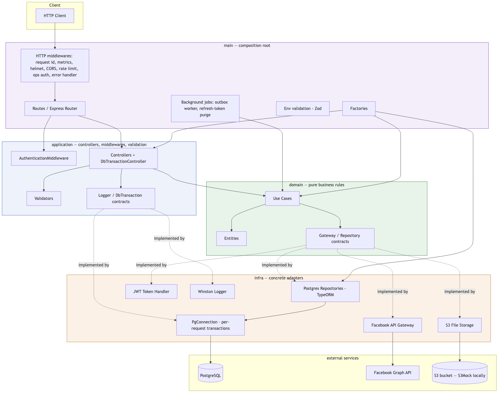
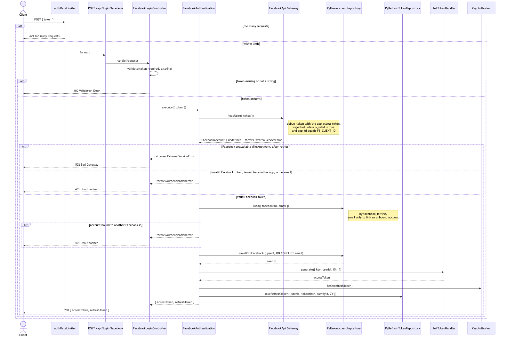
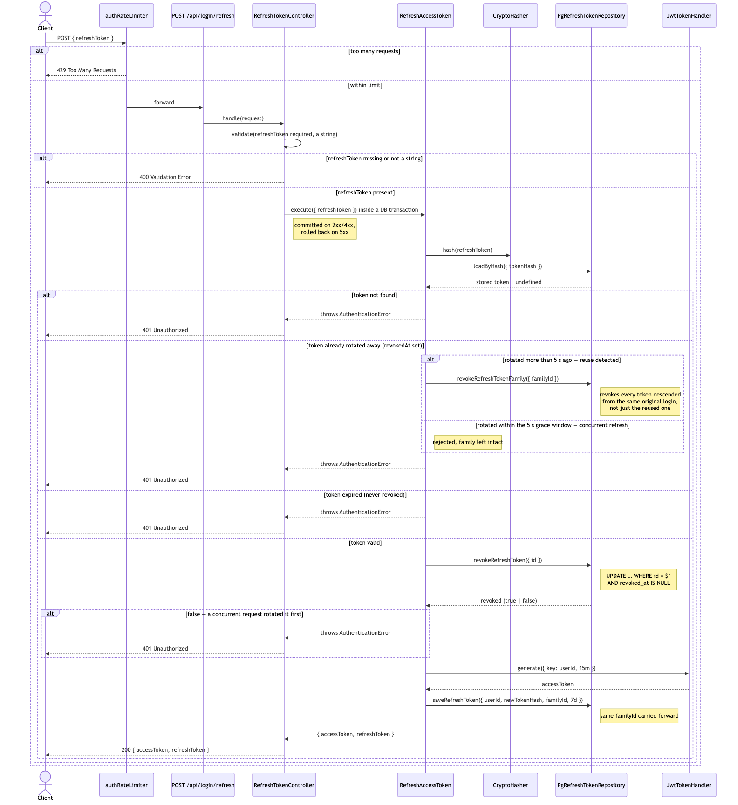
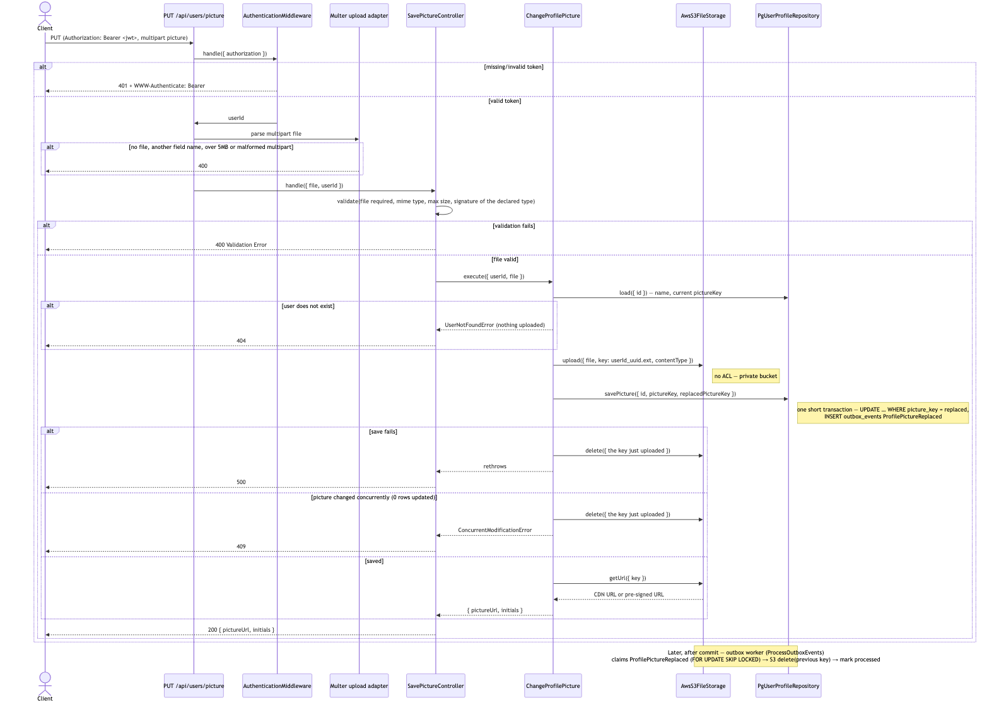
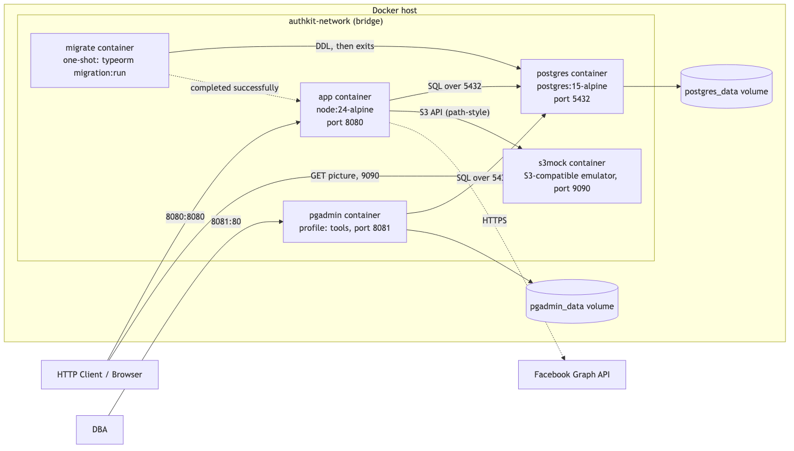
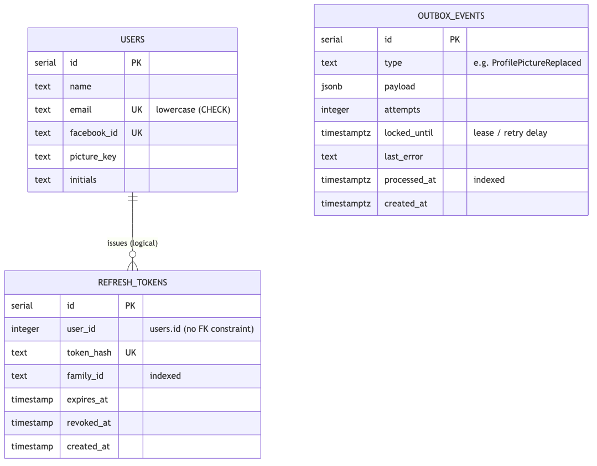

# Documentation

Architecture and flow diagrams for AuthKit. Sources live in [`mmd/`](./mmd) (Mermaid), rendered PNGs in [`img/`](./img). The Postman collection lives in [`api/`](./api). The rationale behind each non-obvious engineering decision is recorded as an ADR in [`adr/`](./adr/README.md).

Written guides: [architecture](./architecture.md) · [development](./development.md) · [operations](./operations.md).

## Architecture overview (top-level, in the root README)

[`img/architecture.svg`](./img/architecture.svg) is the single-image, high-level view embedded at the top of the root [README](../README.md). It shows:

- the request path through `main` → `application` → `domain` → `infra`;
- the data stores and external services: PostgreSQL, the Facebook Graph API, and S3 (private bucket, optional CloudFront, S3Mock in development);
- the background jobs: the outbox worker that deletes replaced pictures, and the expired refresh-token purge;
- response codes;
- the observability and health endpoints.

Its source is `img/architecture.html` next to it. Edit the SVG markup there, then copy the `<svg>` element (inlined styles included) into `architecture.svg`.

## System architecture

Layering (domain / application / infra / main), the request path through the HTTP middlewares, and how each layer's contracts are implemented by infra adapters.



Source: [`mmd/architecture-overview.mmd`](./mmd/architecture-overview.mmd)

## Facebook login flow

`POST /api/login/facebook` — rate limiting, the Facebook Graph API call (with retry/timeout), user upsert, and access/refresh token issuance.



Source: [`mmd/request-flow-facebook-login.mmd`](./mmd/request-flow-facebook-login.mmd)

## Refresh-token rotation & reuse detection

`POST /api/login/refresh` — hash lookup, atomic rotation of a valid token, and what happens when an already-rotated token is presented again: the entire token family is revoked, not just the reused token, unless the replay falls inside the 5-second grace window for concurrent refreshes (see [ADR-0010](./adr/0010-refresh-token-reuse-detection-and-family-revocation.md) and [ADR-0013](./adr/0013-atomic-refresh-token-rotation-and-reuse-grace-window.md)).



Source: [`mmd/request-flow-refresh-token.mmd`](./mmd/request-flow-refresh-token.mmd)

## Profile picture upload flow

`PUT /api/users/picture` — authentication, multipart parsing, validation (mime type / size / magic-byte signature), upload without ACL, saving the storage key, cleanup of the uploaded object on failure or of the previous one on success, and URL resolution (CDN or pre-signed).



Source: [`mmd/request-flow-picture-upload.mmd`](./mmd/request-flow-picture-upload.mmd)

## Deployment (Docker)

Containers, network, and volumes defined in `docker-compose.yml` (including the one-shot `migrate` service that runs before `app`), plus the external services the `app` container talks to.



Source: [`mmd/deployment-docker.mmd`](./mmd/deployment-docker.mmd)

## Database schema

Owned by TypeORM migrations (`src/infra/repos/postgres/migrations/`), checked against the entities by `npm run migration:check`. `users` has unique `email` and `facebook_id` and stores the picture's storage key. `refresh_tokens` stores token hashes, with `family_id` for family revocation.



Source: [`mmd/db-schema.mmd`](./mmd/db-schema.mmd)

## Regenerating the images

```bash
npx --yes @mermaid-js/mermaid-cli -i docs/mmd/<name>.mmd -o docs/img/<name>.png -b white -s 2
```

## API collection

[`api/collection.postman_collection.json`](./api/collection.postman_collection.json) is the API contract suite, with [`api/environment.postman_environment.json`](./api/environment.postman_environment.json) and the upload files in [`api/fixtures/`](./api/fixtures). `npm run test:api` runs it with newman; see [development.md](./development.md#api-contract-tests) for running it from the Postman app.
