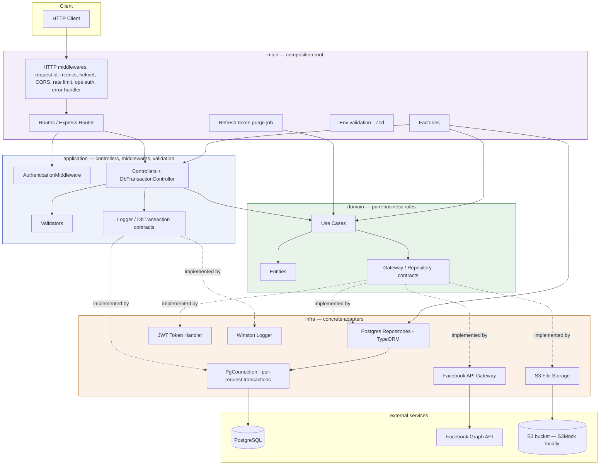

# Architecture

## Layers

- **domain**: entities, use cases and the contracts (ports) they need. It has no framework or I/O imports.
- **application**: controllers, middlewares and validation. Each controller validates input, calls one use case and maps the result to HTTP.
- **infra**: adapters that implement the contracts: PostgreSQL via TypeORM, the Facebook Graph API, AWS S3, JWT, hashing and logging.
- **main**: the composition root. It holds env validation, the factories that wire adapters into use cases, routes, Express setup and the entry points (`index.ts`, `jobs/`).

## The dependency rule, enforced

The layering is enforced by tooling, not only by folder names. There are two independent checks:

- **ESLint `no-restricted-imports`** (`eslint.config.js`) fails `lint` if `domain` or `application` imports `express`, `typeorm`, `axios`, `multer`, `winston`, `jsonwebtoken`, `@aws-sdk/*`, or anything under `infra`/`main`.
- **`tests/architecture/import-boundaries.spec.ts`** statically scans the same layers for the same imports and fails the test run. It does not depend on the lint config, so disabling the ESLint rule inline does not get around it.

For example, `AdvancedHealthCheckController` depends only on a local `DatabaseChecker` port and the `application/contracts/Logger` port. It never touches `PgConnection` or Winston directly; `main` wires both in.

## Directory map

| Path | Purpose |
|------|---------|
| `src/domain` | Entities, use cases, gateway/repository contracts |
| `src/application` | Controllers, middlewares, DTOs, validation builders |
| `src/infra` | Gateways, repositories, entities and migrations, logger |
| `src/main` | Entry point, env config, factories, routes, Swagger, scheduled jobs |
| `tests` | Unit, E2E (pg-mem), real-Postgres, architecture and live-external tests (mirrors `src`) |
| `scripts` | DB seed, dev token generator, Postman collection runner |
| `docs` | Guides, diagrams (Mermaid sources + PNGs), ADRs, Postman collection and its upload fixtures |

## Tech stack

Node.js 24 (LTS), TypeScript 5.9, Express 5, PostgreSQL 15 with TypeORM migrations, Zod, Jest with ts-jest, pg-mem, Multer, AWS SDK v3, Axios, Helmet, express-rate-limit, @prometheus-io/client, Winston, and Swagger UI.

## Trade-offs

Each of these has a full ADR in [`adr/`](adr/README.md):

- Express as a thin adapter rather than NestJS ([0002](adr/0002-express-as-thin-http-adapter.md)).
- TypeORM ([0003](adr/0003-typeorm-for-persistence.md)).
- pg-mem for the fast suite, with real Postgres where it matters ([0004](adr/0004-pg-mem-for-e2e-tests.md)).
- JWT plus an opaque refresh token ([0005](adr/0005-jwt-access-token-with-opaque-refresh-token.md)).
- SHA-256 rather than bcrypt for refresh tokens ([0006](adr/0006-sha256-hash-for-refresh-tokens.md)).
- In-memory rate limiting ([0008](adr/0008-in-memory-rate-limiting.md)).
- A modular monolith ([0009](adr/0009-modular-monolith.md)).
- Token-family revocation ([0010](adr/0010-refresh-token-reuse-detection-and-family-revocation.md)).
- Prometheus metrics instead of tracing ([0011](adr/0011-prometheus-metrics-endpoint.md)).
- The production operational surface ([0012](adr/0012-production-operational-surface.md)).
- Atomic, transactional rotation with a grace window ([0013](adr/0013-atomic-refresh-token-rotation-and-reuse-grace-window.md)).
- Account identity by Facebook id ([0014](adr/0014-account-identity-by-facebook-id.md)).
- Private picture storage and S3Mock ([0015](adr/0015-private-picture-storage-and-s3mock.md)).
- Transactional outbox for deleting replaced pictures ([0016](adr/0016-transactional-outbox-for-picture-cleanup.md)).
